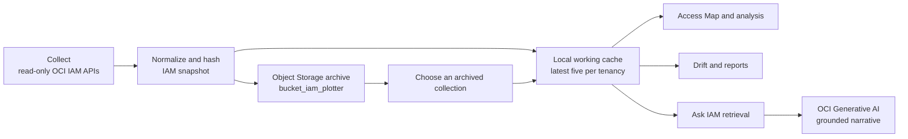

# OCI IAM Plotter

OCI IAM Plotter is a read-only OCI IAM intelligence portal. It collects a portable identity snapshot, maps relationships across users, groups, domains, applications, dynamic groups, and policies, then turns the cached evidence into investigations, drift reviews, reports, and grounded Ask IAM conversations.

It never changes OCI IAM resources. OCI remains the authority for effective runtime authorization.

## What it helps you do

- Collect classic IAM and Identity Domains evidence: tenancy metadata, compartment hierarchy, users, groups, memberships, domains, dynamic-group rules, policies, applications, and grants.
- Explore a focused **Access Map** around one or more subjects, with pan, zoom, layouts, an expandable tree, and PNG/PDF/JSON exports.
- Review inventory, user access evidence, policy statements, duplicate candidates, and drift between collections.
- Build inventory or comparison reports for zero, one, or multiple users; download filtered evidence as Excel, CSV, JSON, Markdown and PDF where applicable.
- Use **Ask IAM** for multi-turn, evidence-first questions. It retrieves the selected snapshot before asking OCI Generative AI for a concise narrative, with a deterministic fallback.
- Switch tenancies and select durable historical collections from Object Storage.

## Workflow



## Snapshot persistence

Successful web collections are written to the local working cache and archived to `bucket_iam_plotter` under:

```text
tenancies/<tenancy-name-and-id>/<collection-date>/snapshot-<hash>.json
```

The local cache keeps the newest five collections per tenancy for fast use. The sidebar’s **Object Storage collections** picker can activate any archived snapshot without removing the local retention limit. Local runs use the configured OCI user principal; OCI Generative AI Hosted Applications use their resource principal.

## Get started

```bash
python3 -m venv .venv
source .venv/bin/activate
python -m pip install -e '.[test]'
./start.sh
```

Open `http://127.0.0.1:8501`, sign in, expand the left sidebar if needed, and use **Collect**. The collection dialog accepts either OCI API-signing credentials or security-token authentication. Supplied credential material is removed after the collection run.

## Documentation

- [Local development](docs/local-development.md)
- [OCI Generative AI hosted deployment](docs/hosted-deployment.md)
- [Configuration reference](docs/configuration.md)
- [Architecture and data flow](docs/architecture.md)
- [Security and IAM boundaries](docs/security.md)
- [Application capabilities](SKILLS.md)

## Validation

```bash
pytest -q
npm run build
```

The production deployment uses the OCI Generative AI Hosted Application runtime. See the [hosted deployment guide](docs/hosted-deployment.md) for prerequisite IAM policy, resource-principal Object Storage access, artifact lifecycle, and release commands.
